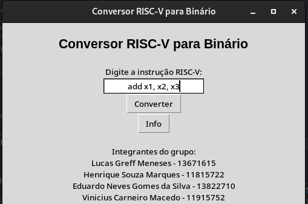
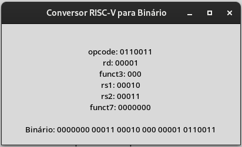

# RISC-V to Binary Converter

*Lucas Greff Meneses - 13671615  
Henrique Souza Marques - 11815722  
Eduardo Neves Gomes da Silva - 13822710  
Vinicius Carneiro Macedo - 11915752    
Institute of Mathematical and Computer Sciences  
University of São Paulo*  

**Abstract:** This monograph aims to present the second practical project of the Computer Organization and Architecture course. Among the proposed topics and challenges faced by the group participants, we decided to develop an application that converts certain RISC-V instructions into their respective binary codes.

### Introduction

RISC-V is an open instruction set architecture that serves as a bridge between high-level and low-level computer communication. This communication occurs through the conversion of commands of various types, such as "beq" of "Type B", into 32-bit words that processors interpret, thereby executing programs. In this scenario, a challenge arises - our difficulty in looking at binary code and being able to interpret it or verify its correctness.

### Development

In this section, we will present the method we employed to streamline the process of verifying and interpreting instructions converted to binary. We chose to use the Python programming language to create our program, where we mapped the instruction types and their corresponding operations. The mapped types include: B, I, J, R, S, and U. Each team member was responsible for developing the code section that handles each instruction type, thus creating functionalities that convert instruction sets into binary and break them down and explain them according to the RISC-V architecture.

**RISC-V Assembly Instruction**  
    

**Binary Instruction**  
  

### Conclusion

We have developed a Python application capable of converting RISC-V instructions into binary and splitting this sequence into parts corresponding to the characteristics of each instruction.

**References:** The RISC-V Instruction Set Manual Volume I: User-Level ISA Document Version 2.2
